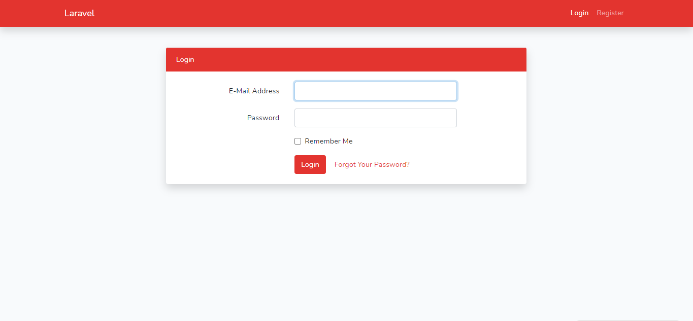
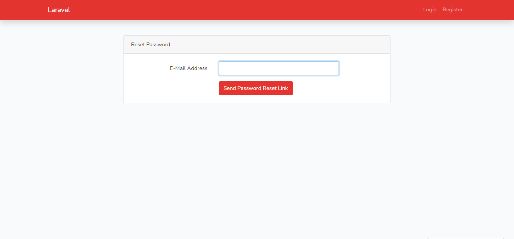
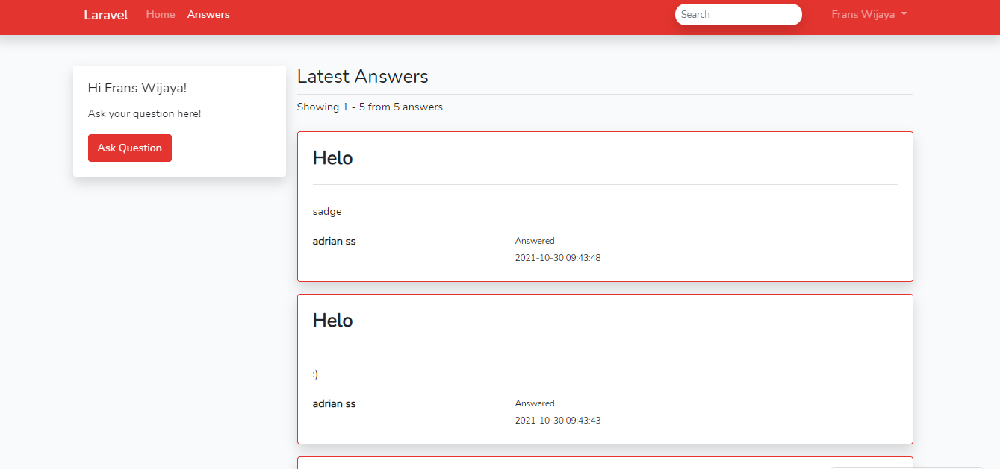
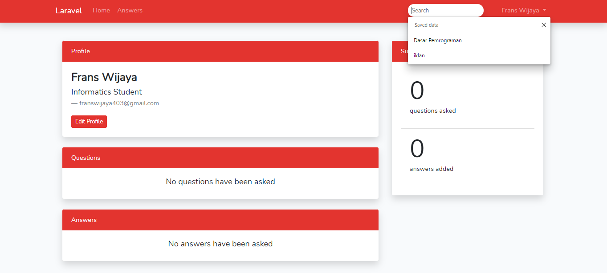
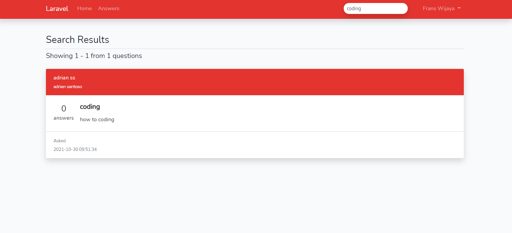
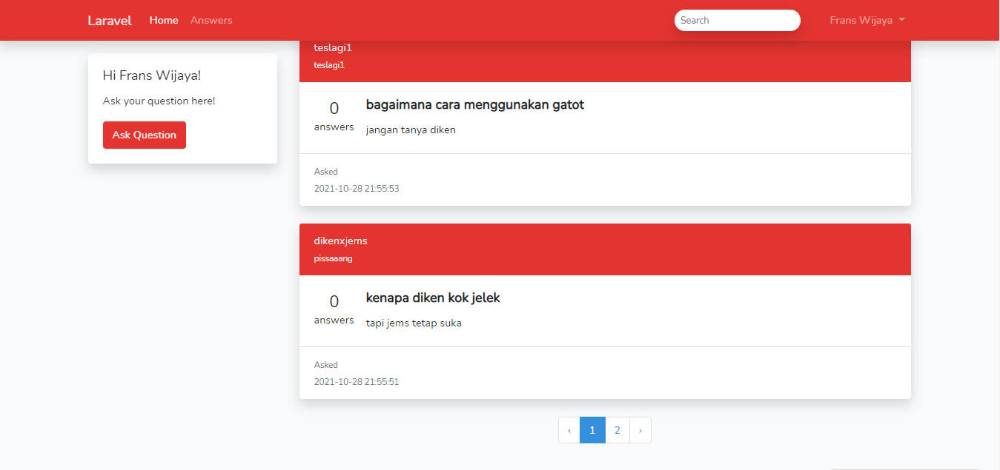

## About GonnaSolve
This project was builded for the Software House task. Creating simple online forum that adopt between [Quora](https://quora.com) and [StackOverflow](https://stackoverflow.com) concept.

### Documentation

### 1. Login

Here, you need to input your email address and password to be logged in to GonnaSolve. There are also remember me and forgot password feature.

### 9. See latest answer

If you want to see the latest answer. You need to go to the answers page. Then, you can see the other user’s latest answer.

### 10. Search Question

If you want to search some content. You need to go to the home page. Fill the search content on the top of the page then press Enter. You can see the page after being filtered.

### 11. Pagination

The pagination will appear if the content is above 10 response.
