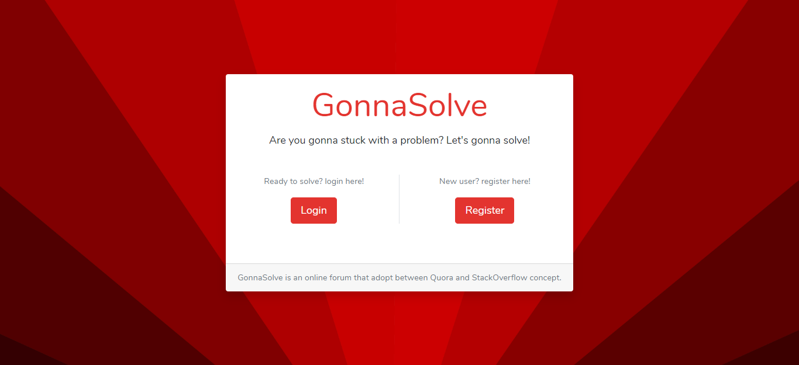
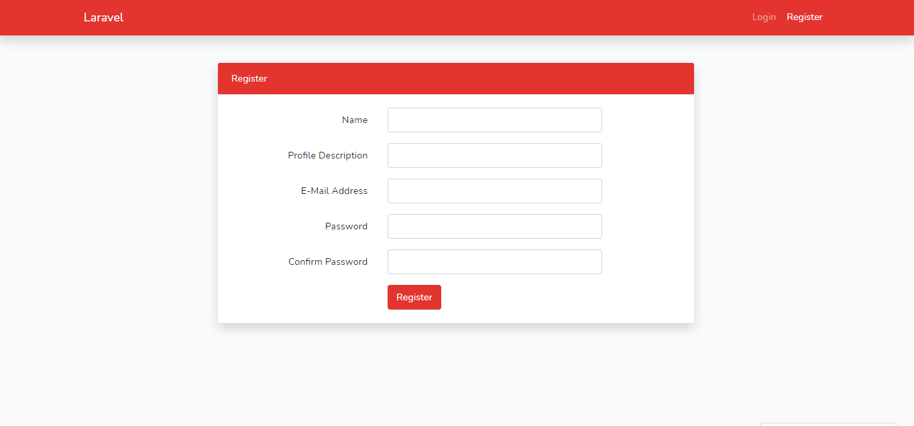
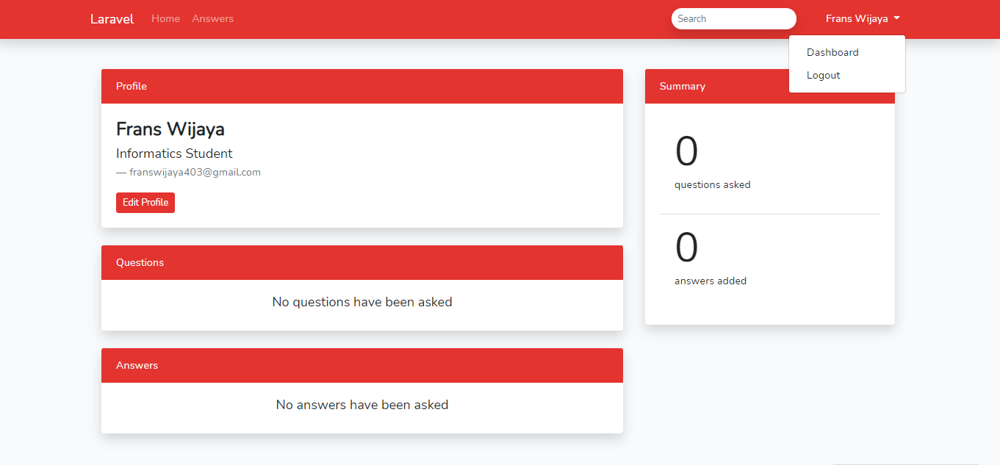
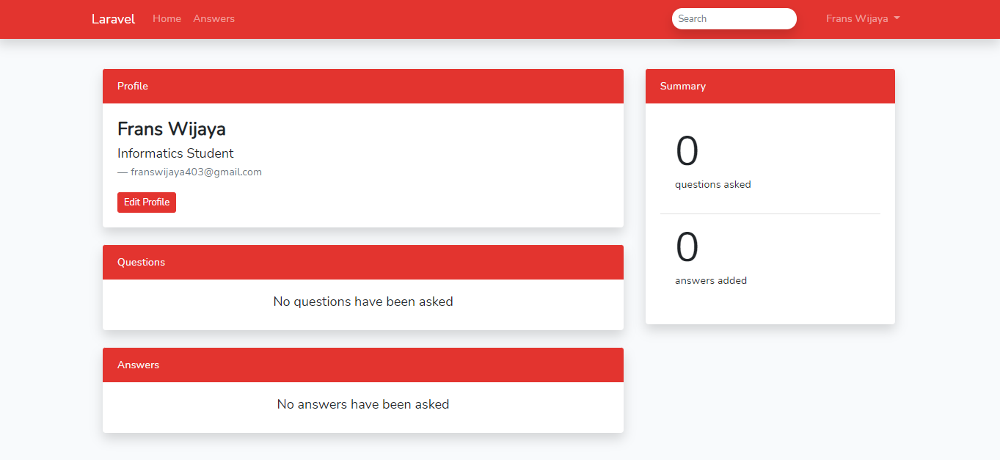
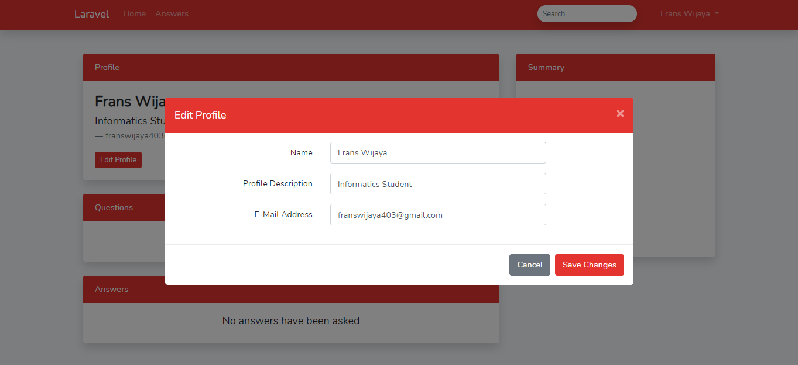
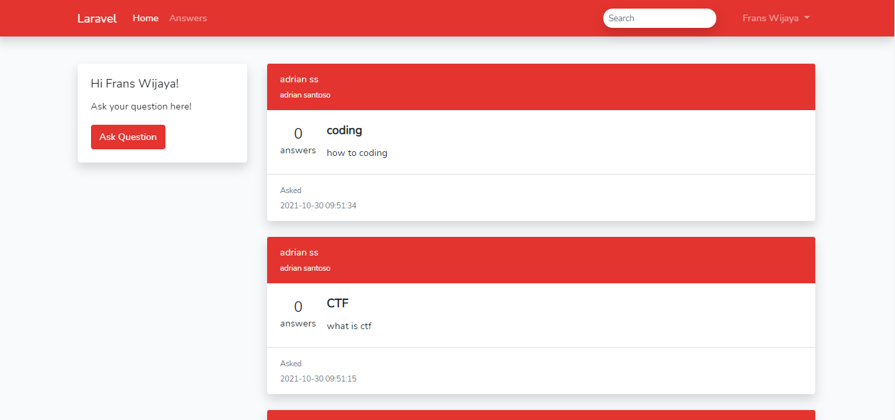
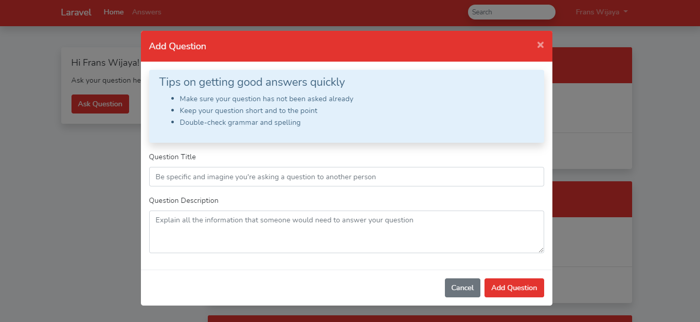
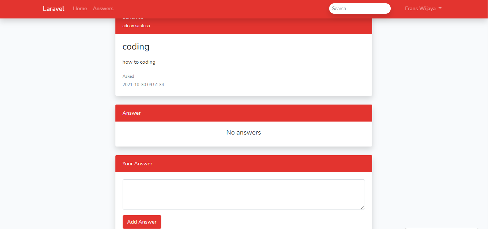

# ETS - PWEB - C

* Frans Wijaya        - 05111940000097
* Adrian Santoso      - 05111940000130
* Vincent Yonathan    - 05111940000186
---
### The Website
[GonnaSolve](http://gonnasolve.000webhostapp.com/)

---
### Content
* [About GonnaSolve](#About-GonnaSolve)
* [Documentation](#Documentation)
---

## About GonnaSolve
GonnaSolve is a project built for the Midterm Exam of Web Programming Class C by the three of us. The purpose of makint this website, aside from the midterm exam is to create a forum where people can visit and gain information about programming, we want to make people keep on being curious about anything in life, and keep on wanting to know more. This webiste is basically a simple online *Q&A* (Question and Answer) forum that adopt between [Quora](https://quora.com) and [StackOverflow](https://stackoverflow.com) concept.

---
## Documentation

### 1. Landing Page

On landing page, you may choose between login into an existing account or register a new account.

### 2. Login

Here, you need to input your email address and password to be logged in to GonnaSolve. There are also remember me and forgot password feature.

### 3. Register

On this page, you can register a new account. Email and password are the main requirements here.

### 4. Logout

By clicking your profile name on top right of the page, you can access dropdown menu that contains dashboard and logout link.

### 5. Dashboard

On the dashboard page, information about your profile, question, answer, and also summary are displayed. Under the profile description, there is an edit profile button that can be clicked to access the edit profile form.

### 6. Home

On this page, questions asked and also the answers of many accounts are displayed. To ask a question, click on the "Add Question" button on top left of the page.

You can also add answers for the asked questions. By clicking the title oh the question, you will be redirected to question details page.

### 7. See latest answer

If you want to see the latest answer. You need to go to the answers page. Then, you can see the other user’s latest answer.

### 8. Search Question

If you want to search some content. You need to go to the home page. Fill the search content on the top of the page then press Enter. You can see the page after being filtered.

### 9. Pagination

The pagination will appear if the content is above 10 response.

[Back to Top](#Content)
